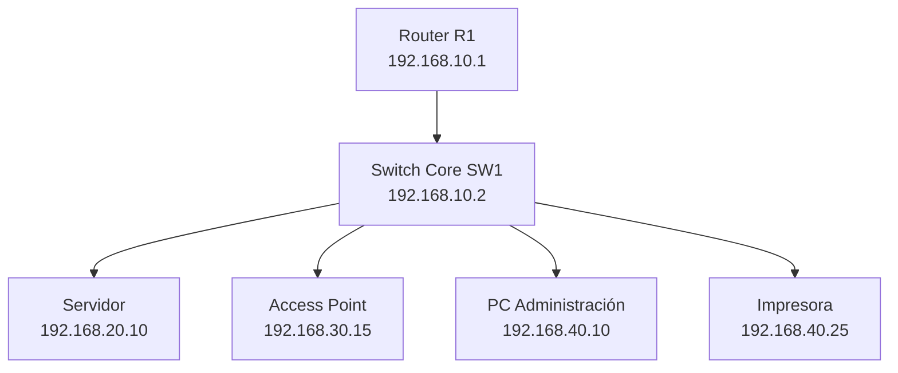

# Topología de laboratorio

La topología propuesta para acompañar el proyecto en Cisco Packet Tracer es sencilla y está pensada para practicar direccionamiento, conectividad y segmentación básica.

## Segmentos usados

- Infraestructura: `192.168.10.0/24`
- Servidores: `192.168.20.0/24`
- Wi-Fi: `192.168.30.0/24`
- Usuarios y periféricos: `192.168.40.0/24`

Los archivos de la carpeta `docs/cisco` incluyen una configuración de ejemplo para recrear la práctica. No se incluye un archivo `.pkt` porque es un formato binario propio de Packet Tracer.
